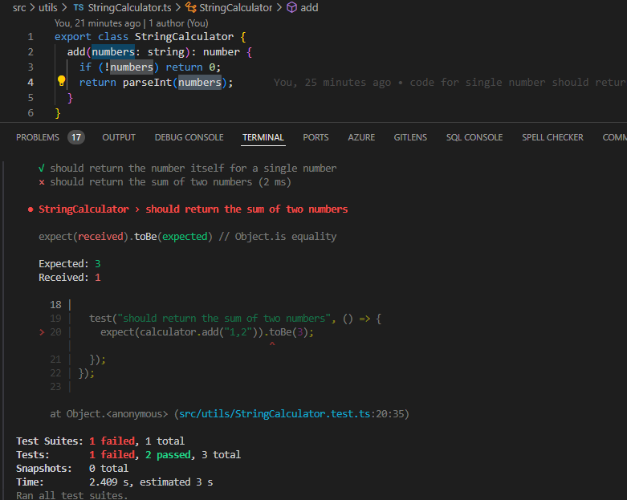
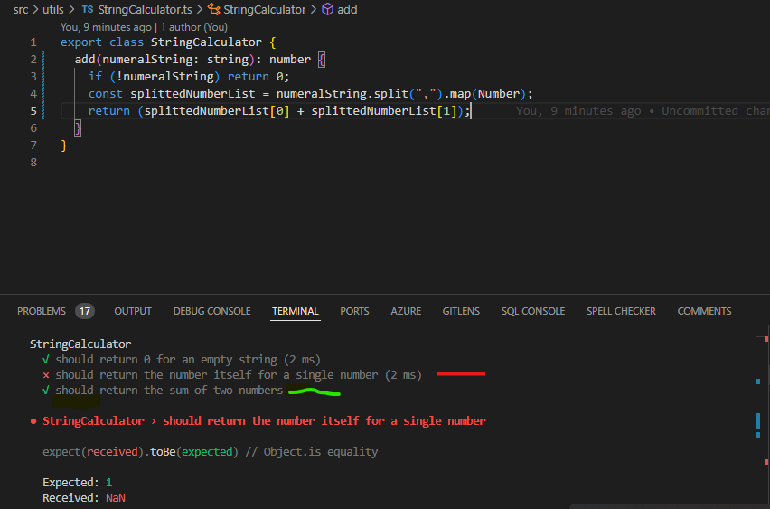
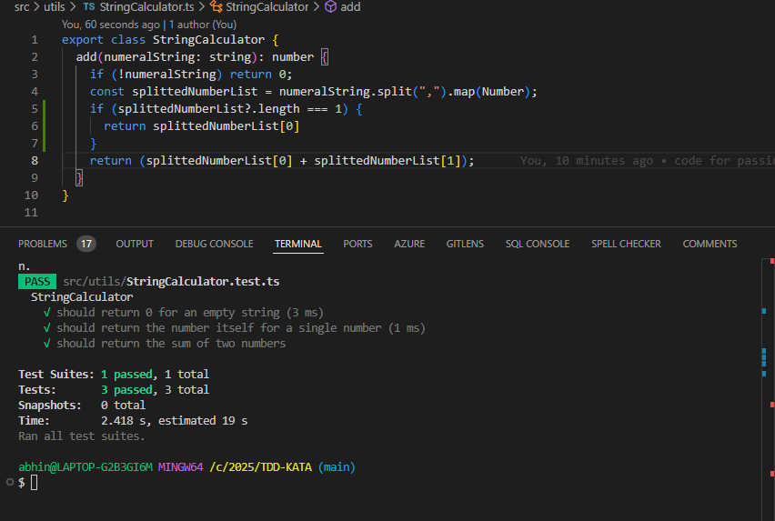
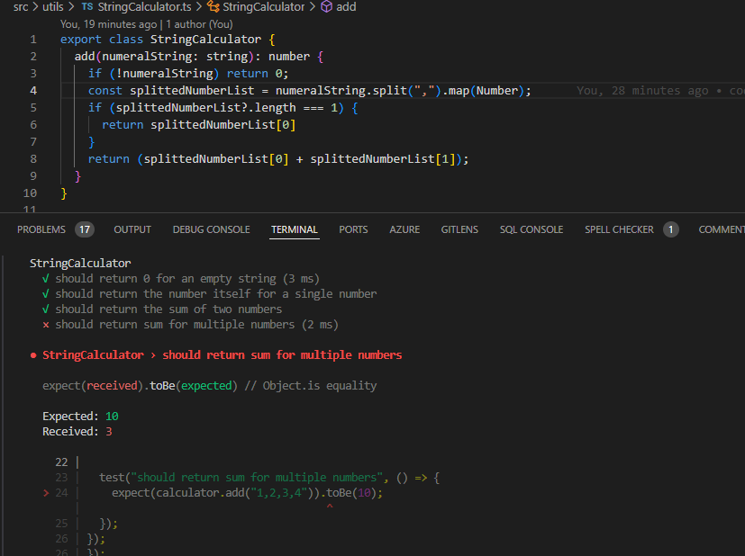
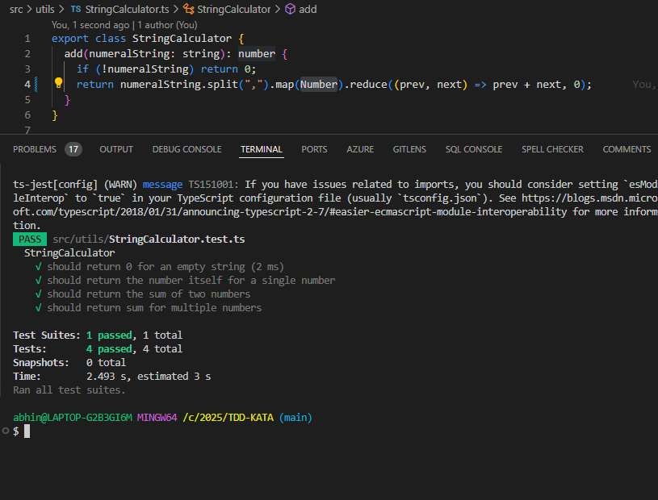
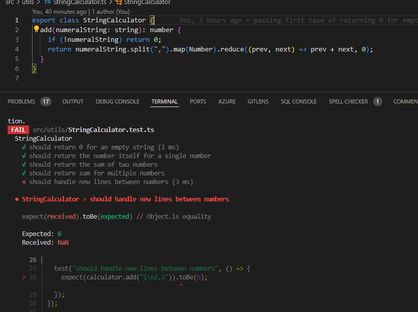
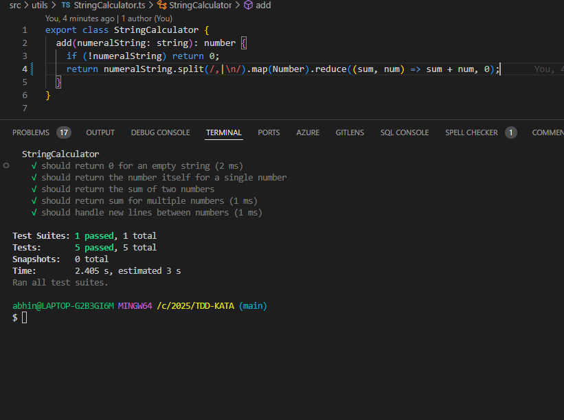
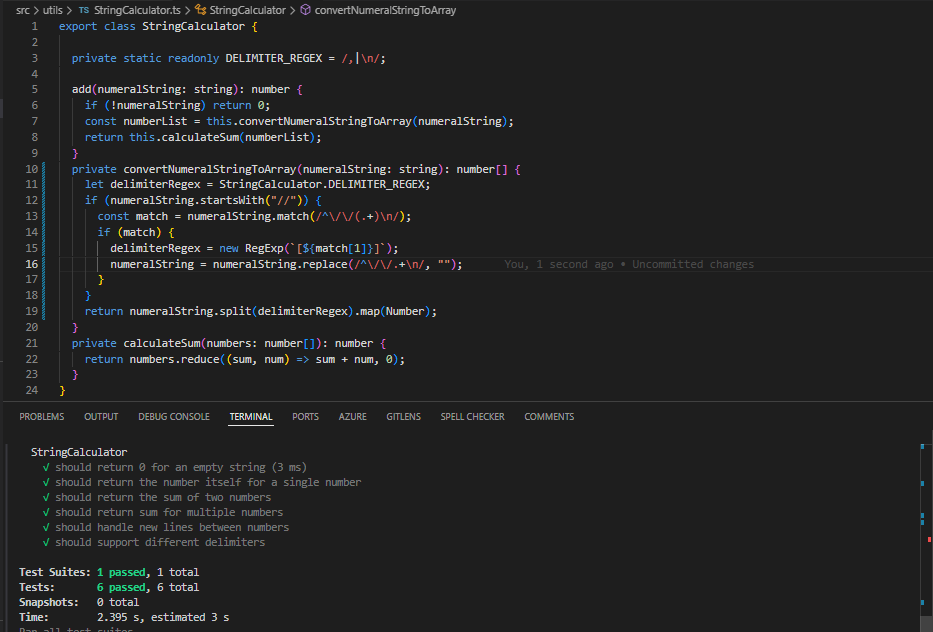

# React + TypeScript + Vite

This template provides a minimal setup to get React working in Vite with HMR and some ESLint rules.

## Implementing TDD KATA!

- First failing test case

 

- First passing test case with the simplest code.

- single number should return itself

- Two number scenario

### However the test case got passed but it broke the single number test case and developer got a notice about,hence the code can be refactored.This demonstrates the glory of test driven development.Later we will see example of passing the test case without failing the earlier ones via refactoring the code.

- Two number scenario without Failing the previous ones
  

- Unknown/multiple amount of numbers
  

- Handling new lines between numbers
  

- Handling Custom delimiter other than comma and new lines

