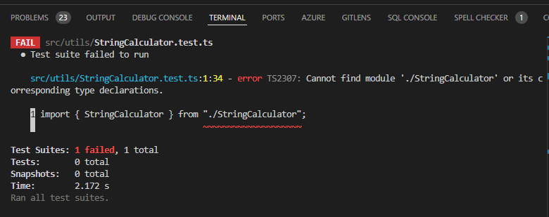
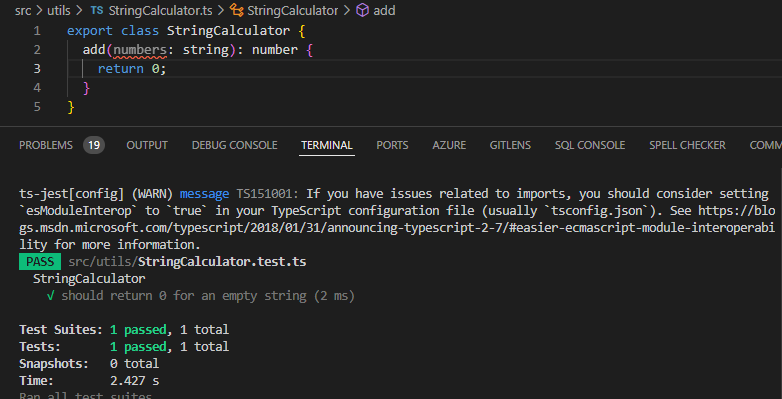
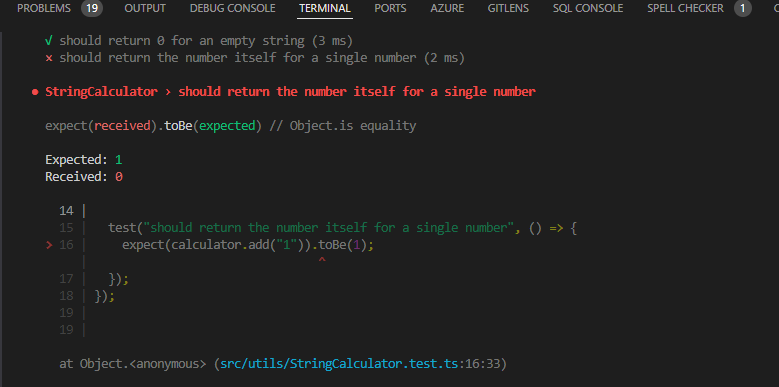
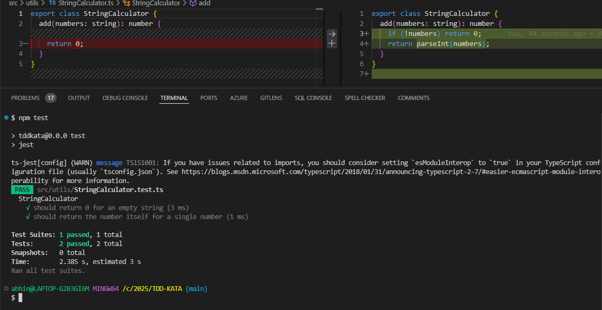

# React + TypeScript + Vite

This template provides a minimal setup to get React working in Vite with HMR and some ESLint rules.

## Implementing TDD KATA!

- First failing test case
 

- First passing test case with the simplest code.

- single number should return itself

